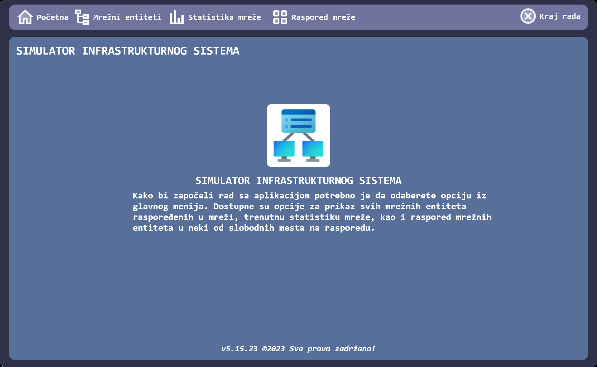
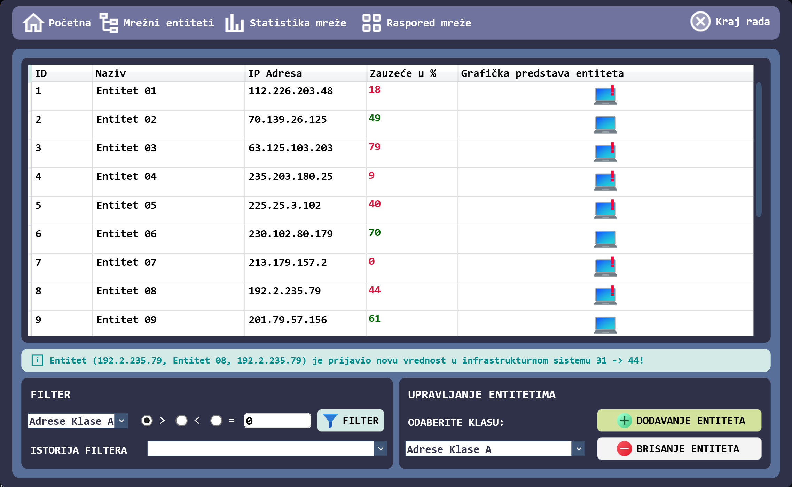
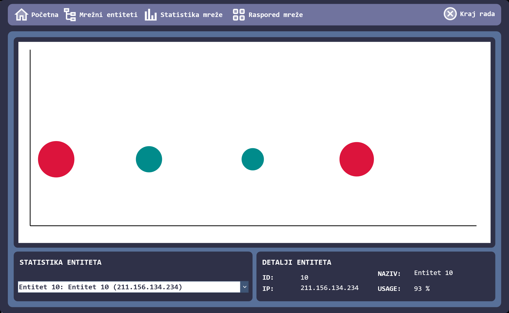
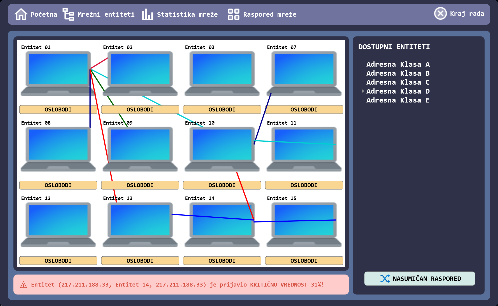

 
 <h2 align="center">Network Manager</h2>
 
Aplikacija kreirana po MVVM šablonu, za rad sa mrežnim entitetima.

  

    
    
    
    
    
     
     
     
  

  

    <a href="https://github.com/owlCoder/Network-Manager/issues/new/choose">Prijava Bug-a</a>
    ·
    <a href="https://github.com/owlCoder/Network-Manager/issues/new/choose">Nova mogućnost u aplikaciji</a>
    ·
    <a href="https://github.com/owlCoder/Network-Manager/discussions">Postavite pitanje</a>
  

   

# Mogućnosti Aplikacije

-   Dodavanje novog mrežnog entiteta
-   Multikorisničko okruženje dodavanja/pregleda
-   Pregled statistike i grafikona
-   Pretraga po kriterijumu 
-   Drag & Drop entiteta
-   Povezivanje entiteta u mreži

 

# Korisnički Interfejs

  

  

  

> **Warning**
> Izgled aplikacije je podložan promeni i predstavlja trenutnu ilustraciju UI!

 

Spisak osoba koje su doprineli da projekat "Network Manager" postane javno dostupan.

- @owlCoder    -> Danijel Jovanović

> **Note**
> Spisak ljudi koji su učestovali odnosi se na trenutak izmene README datoteke i može se razlikovati u budućnosti!

